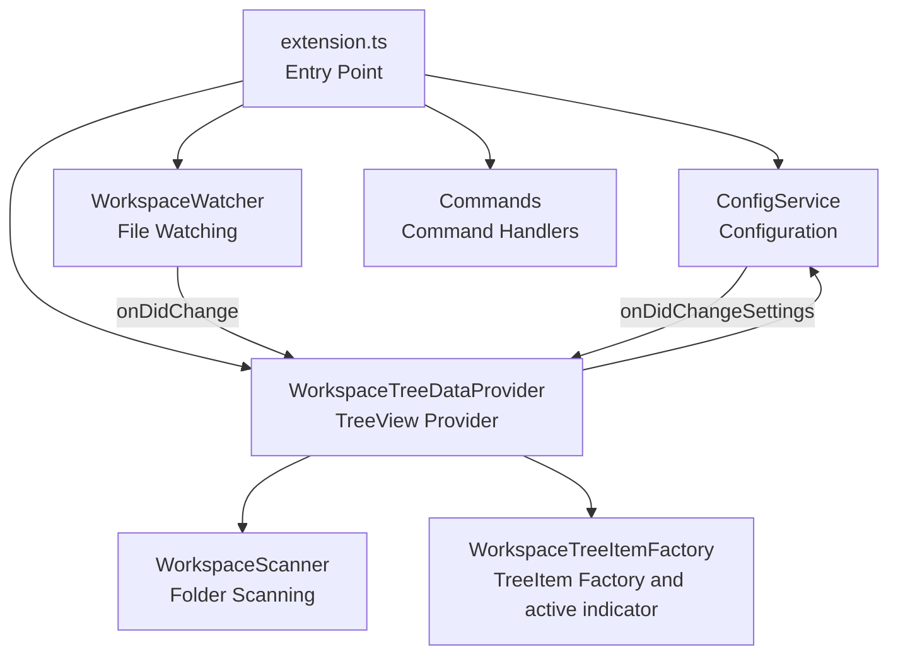

# Workspace Navigator

[](LICENSE)
[](CHANGELOG.md)
[](https://code.visualstudio.com/)
[](https://www.typescriptlang.org/)

A VS Code extension that scans `.code-workspace` files and provides a TreeView for quickly switching between workspaces.

## Table of Contents

- [Workspace Navigator](#workspace-navigator)
  - [Table of Contents](#table-of-contents)
  - [✨ Features](#-features)
  - [🚀 Quick Start](#-quick-start)
  - [📋 Prerequisites](#-prerequisites)
  - [📦 Installation](#-installation)
    - [From VS Code Marketplace](#from-vs-code-marketplace)
    - [Build from Source](#build-from-source)
  - [📖 Usage](#-usage)
    - [Adding Scan Folders](#adding-scan-folders)
    - [Removing Scan Folders](#removing-scan-folders)
    - [Switching Workspaces](#switching-workspaces)
    - [Finding the Current Workspace](#finding-the-current-workspace)
    - [Refreshing the Tree](#refreshing-the-tree)
    - [Expanding All Folders](#expanding-all-folders)
  - [⚙️ Configuration](#️-configuration)
    - [Example](#example)
  - [🎯 Commands](#-commands)
  - [📁 Directory Structure](#-directory-structure)
  - [🏗️ Architecture](#️-architecture)
  - [🧪 Development](#-development)
    - [Build](#build)
    - [Watch Mode](#watch-mode)
    - [Testing](#testing)
    - [Linting](#linting)
    - [Debugging](#debugging)
    - [Package Scripts](#package-scripts)
  - [📝 Release Notes](#-release-notes)
  - [📄 License](#-license)

## ✨ Features

- **TreeView Workspace List** - Browse `.code-workspace` files in a tree view from the sidebar
- **One-Click Switching** - Open workspaces in the current window or a new window
- **Real-Time Watching** - Automatically detects workspace file creation, content changes, and deletion
- **Active Workspace Indicator** - Visually identifies the currently open workspace with an icon
- **Current Workspace Navigation** - Reveals and selects the current workspace even when it is nested in collapsed folders
- **Flexible Scan Settings** - Add or remove multiple scan folders and configure exclude patterns
- **Folder Hierarchy** - Displays workspaces while preserving subfolder structure
- **Expand All Action** - Expand all folder nodes in one click from the view title bar

## 🚀 Quick Start

1. Install the extension
2. Click the **Workspace Manager** icon in the sidebar
3. Click "**Add Scan Folder**" to add a folder to scan
4. Click a workspace to switch to it

## 📋 Prerequisites

- Users: [Visual Studio Code](https://code.visualstudio.com/) v1.109.0 or later
- Building from source: Node.js v22 or later and pnpm v10.30.1

## 📦 Installation

### From VS Code Marketplace

1. Open the Extensions panel in VS Code (`Ctrl+Shift+X`)
2. Search for `Workspace Navigator`
3. Click "Install"

You can also install it from the command line:

```bash
code --install-extension luckgakidz.workspace-navigator
```

### Build from Source

```bash
git clone https://github.com/luckgakidz/workspace-navigator.git
cd workspace-navigator
pnpm install
pnpm run compile
```

To generate the `0.0.1` VSIX package:

```bash
pnpm exec vsce package --out workspace-navigator-0.0.1.vsix
```

## 📖 Usage

### Adding Scan Folders

1. Open the **Workspace Manager** view in the sidebar
2. Click the **+** icon in the title bar, or select "**Add Scan Folder**"
3. Choose a folder containing `.code-workspace` files

### Removing Scan Folders

1. Right-click a scan folder at the root of the **Workspace Manager** tree
2. Select "**Remove Scan Folder**"
3. Confirm the removal

This removes only the folder path from the extension settings. The actual folder and its files are never deleted.

### Switching Workspaces

- **Open in current window** - Click a workspace name in the tree
- **Open in new window** - Click the window icon shown to the right of a workspace

### Finding the Current Workspace

Click the **Current Workspace** target icon in the view title bar. Workspace Navigator expands the required parent folders, selects the currently open `.code-workspace` file, and focuses it in the tree.

If no `.code-workspace` file is open, or the current workspace is outside the configured scan folders, the extension displays an informational message without changing the tree.

### Refreshing the Tree

- Click the **Refresh** icon in the title bar
- File changes within scan folders are automatically detected

### Expanding All Folders

- Click the **Expand All** icon in the title bar to recursively expand all scan folders and subfolders

## ⚙️ Configuration

Configure via `settings.json` or the Settings UI (`Ctrl+,`).

| Setting | Type | Default | Description |
|---------|------|---------|-------------|
| `workspaceManager.scanFolders` | `string[]` | `[]` | List of folder paths to scan for workspace files |
| `workspaceManager.excludePatterns` | `string[]` | `["**/node_modules", "**/.git", "**/.vscode"]` | Glob patterns to exclude from scanning |

### Example

```jsonc
{
  "workspaceManager.scanFolders": [
    "C:\\Users\\user\\projects",
    "D:\\workspaces"
  ],
  "workspaceManager.excludePatterns": [
    "**/node_modules",
    "**/.git",
    "**/archive"
  ]
}
```

## 🎯 Commands

| Command | Title | Description |
|---------|-------|-------------|
| `workspaceManager.openWorkspace` | Open Workspace | Open the selected workspace in the current window |
| `workspaceManager.openWorkspaceInNewWindow` | Open Workspace in New Window | Open the selected workspace in a new window |
| `workspaceManager.refresh` | Refresh | Re-scan and refresh the workspace tree |
| `workspaceManager.revealCurrentWorkspace` | Reveal Current Workspace | Reveal and select the currently open workspace in the tree |
| `workspaceManager.expandAll` | Expand All | Expand all scan folder and folder nodes in the tree |
| `workspaceManager.addScanFolder` | Add Scan Folder | Add a folder to the scan list |
| `workspaceManager.removeScanFolder` | Remove Scan Folder | Remove a folder from the scan list without deleting files |
| `workspaceManager.openSettings` | Open Settings | Open the extension settings |

## 📁 Directory Structure

```
workspace-navigator/
├── src/
│   ├── extension.ts                  # Entry point (activate / deactivate)
│   ├── commands/
│   │   ├── openWorkspace.ts          # Open and scan-folder command handlers
│   │   └── revealCurrentWorkspace.ts # Current workspace navigation command
│   ├── core/
│   │   ├── configService.ts          # Configuration management
│   │   ├── pathUtils.ts              # Cross-platform path comparison
│   │   ├── types.ts                  # Type definitions
│   │   ├── workspaceScanner.ts       # Folder scanning
│   │   └── workspaceWatcher.ts       # File system watching
│   ├── providers/
│   │   ├── workspaceTreeDataProvider.ts  # TreeView data provider
│   │   └── workspaceTreeItemFactory.ts  # TreeItem factory
│   └── test/
│       └── extension.test.ts         # Tests
├── resources/
│   ├── workspace-manager.svg         # Activity bar icon
│   ├── marketplace-icon.svg          # Marketplace icon source
│   └── icon.png                      # Marketplace icon
├── scripts/
│   └── build.ps1                     # VSIX package build script
├── package.json
├── tsconfig.json
├── webpack.config.js
├── eslint.config.mjs
├── CHANGELOG.md
└── LICENSE
```

## 🏗️ Architecture



## 🧪 Development

### Build

```bash
pnpm install
pnpm run compile
```

### Watch Mode

```bash
pnpm run watch
```

### Testing

```bash
pnpm run pretest
pnpm run test
```

### Linting

```bash
pnpm run lint
```

### Debugging

1. Open the project in VS Code
2. Press `F5` to launch the Extension Development Host
3. Check the **Workspace Manager** in the sidebar of the new window

### Package Scripts

| Script | Description |
|--------|-------------|
| `compile` | Build with Webpack |
| `watch` | Webpack watch mode |
| `package` | Production build |
| `compile-tests` | Compile TypeScript for tests |
| `watch-tests` | Watch mode for tests |
| `pretest` | Pre-test build + lint |
| `lint` | Run ESLint |
| `test` | Run tests |

## 📝 Release Notes

The current release is `0.0.1`. See [CHANGELOG.md](CHANGELOG.md) for details.

## 📄 License

[MIT](LICENSE) © [luckgakidz](https://github.com/luckgakidz)
